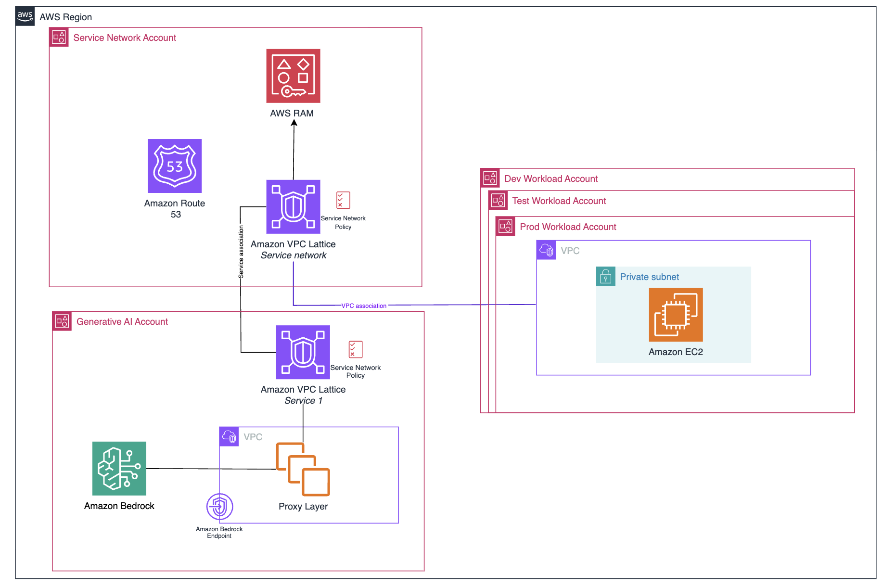

# Strava e Amazon Web Services (AWS)

O **Strava** é uma plataforma digital bastante conhecida entre pessoas que praticam atividades físicas. Ele funciona ao mesmo tempo como aplicativo de monitoramento e como rede social, permitindo que atletas registrem corridas, pedaladas, caminhadas e outros exercícios, além de compartilharem resultados com amigos e comunidades. Atualmente, a plataforma reúne **mais de 150 milhões de usuários em mais de 185 países**, o que mostra o tamanho da sua operação e a quantidade de dados gerados todos os dias.

O principal desafio do Strava surgiu justamente desse grande volume de informações. A cada atividade registrada, o aplicativo coleta vários dados, como distância, ritmo, potência, frequência cardíaca e segmentos percorridos. Embora essas informações sejam muito ricas, nem sempre são fáceis de entender para o usuário comum. Em outras palavras, o problema não era apenas armazenar os dados, mas sim **transformá-los em algo útil, personalizado e fácil de interpretar**. O Strava precisava oferecer uma experiência mais inteligente, capaz de mostrar ao atleta o significado real do seu desempenho, considerando seu histórico recente, seus hábitos e sua evolução ao longo do tempo.

Esse desafio ficou ainda maior porque a plataforma opera em escala global. Milhões de atividades são enviadas diariamente, em diferentes idiomas, perfis de usuários e tipos de exercício. Dessa forma, a empresa precisava de uma solução que conseguisse gerar respostas rápidas, relevantes e personalizadas, sem perder qualidade. Além disso, como a comunicação com o usuário faz parte da experiência do produto, era importante que os textos gerados pela inteligência artificial mantivessem um tom positivo, motivador e alinhado com a identidade da marca.

Foi nesse contexto que o Strava decidiu utilizar a **Amazon Web Services (AWS)**. A escolha da Amazon aconteceu porque a empresa precisava de uma infraestrutura robusta, escalável e já preparada para projetos com inteligência artificial generativa. Em vez de construir toda a base tecnológica do zero, o Strava optou por usar um serviço gerenciado, o que reduziu bastante a complexidade operacional. Isso permitiu que a equipe de engenharia focasse mais no desenvolvimento da funcionalidade em si e menos na manutenção da infraestrutura.

A solução adotada foi o **Amazon Bedrock**, serviço da AWS que oferece acesso a diferentes modelos de inteligência artificial por meio de uma única API. Com isso, o Strava conseguiu testar alternativas e escolher o modelo mais adequado para a sua necessidade. Entre os fatores que justificaram o uso da Amazon, destacam-se a **facilidade de integração**, a **escalabilidade**, a **segurança** e a **flexibilidade para evoluir o produto no futuro**. Outro ponto importante foi a possibilidade de usar o **Amazon Bedrock Guardrails**, recurso que ajuda a filtrar conteúdos inadequados, reduzir erros factuais e manter o tom das respostas dentro do que a empresa considera saudável e apropriado para seus usuários.

Os benefícios dessa decisão foram bastante significativos. Um dos principais foi a **capacidade de escalar o processamento** para atender milhões de usuários, chegando a processar até **14 milhões de tokens por minuto nos horários de pico**. Isso mostra que a solução conseguiu acompanhar a dimensão do Strava sem comprometer o desempenho. Outro benefício relevante foi a **boa aceitação dos usuários**: segundo dados divulgados pela própria empresa, **mais de 80% das pessoas avaliadas consideraram os insights gerados pela IA úteis ou muito úteis**. Esse resultado indica que a funcionalidade realmente agregou valor à experiência do atleta.

Além disso, houve ganhos em **velocidade e eficiência**. Os insights passaram a ser entregues em poucos segundos após o término da atividade, tornando o recurso mais dinâmico e integrado ao uso cotidiano do aplicativo. A AWS também contribuiu para aumentar a **segurança da comunidade**, já que os guardrails ajudam a impedir conteúdos inadequados ou prejudiciais. Por fim, a arquitetura escolhida deu ao Strava mais **flexibilidade tecnológica**, o que é essencial em uma área que evolui tão rapidamente quanto a inteligência artificial.

Em relação à arquitetura da solução, o funcionamento pode ser entendido de forma relativamente simples. Primeiro, o usuário registra sua atividade pelo aplicativo do Strava ou envia os dados por meio de dispositivos conectados, como relógios inteligentes e ciclocomputadores. Em seguida, essas informações são exibidas na tela de detalhes da atividade, com mapas, gráficos e estatísticas. Nos bastidores, o sistema envia esses dados para o **Amazon Bedrock**, onde o modelo de IA analisa não apenas a atividade atual, mas também o histórico recente daquele atleta e os textos adicionados por ele, como título e descrição do treino.

Depois dessa análise, entram em ação os **Bedrock Guardrails**, que verificam tanto o conteúdo recebido quanto a resposta produzida, garantindo mais segurança e controle de qualidade. Por fim, o sistema devolve ao usuário um comentário personalizado e motivador sobre seu desempenho, em linguagem simples e contextualizada. Assim, a arquitetura combina entrada de dados, processamento inteligente, camada de segurança e entrega rápida da resposta final.

Do ponto de vista visual, a arquitetura pode ser representada em um fluxo como este: **Usuário/Dispositivo → Aplicativo Strava → Dados da atividade → Amazon Bedrock (modelo de IA) → Bedrock Guardrails → Insight personalizado no app**.

