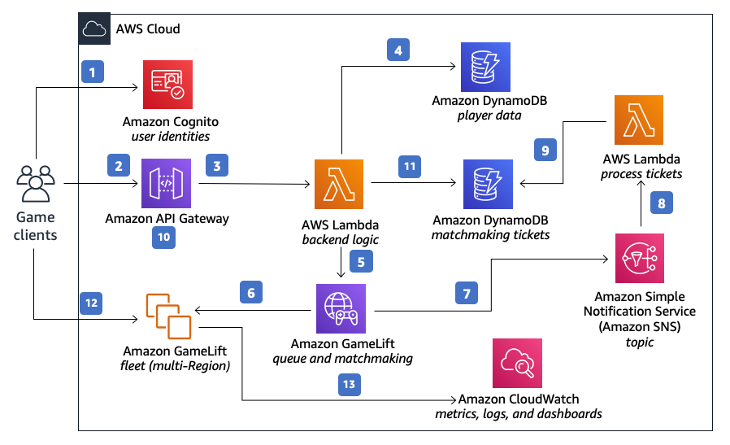

# Capcom e Amazon Web Services (AWS)

A **Capcom** é uma empresa japonesa bastante conhecida no mercado de jogos eletrônicos. Fundada em 1983, ela se tornou uma das maiores produtoras e distribuidoras de games do mundo, sendo responsável por franquias muito populares, como **Street Fighter**, **Resident Evil**, **Devil May Cry** e **Monster Hunter**. Além de desenvolver jogos, a empresa também trabalha com outras formas de aproveitar suas propriedades intelectuais, como filmes, séries, licenciamento de produtos e atrações de entretenimento. Nos últimos anos, a Capcom passou a investir cada vez mais em infraestrutura digital e soluções em nuvem para acompanhar as exigências técnicas dos jogos modernos, principalmente os que dependem fortemente de conectividade online.

O desafio mais recente da empresa apareceu com o lançamento de **Monster Hunter Wilds**, que chegou ao mercado no fim de fevereiro de 2025. A Capcom queria transformar a experiência multijogador da franquia, tornando-a mais ampla, moderna e conectada. Antes disso, os jogos da série dependiam muito da rede de cada plataforma, o que limitava as partidas entre usuários do mesmo ecossistema. Em outras palavras, jogadores de um console não conseguiam, de forma ampla, interagir livremente com usuários de outra plataforma. Além disso, os lobbies do jogo, que são os espaços onde os jogadores se encontram antes das missões, comportavam um número reduzido de participantes, chegando ao limite de apenas 16 pessoas por vez.

Com o lançamento simultâneo para **PlayStation 5, Xbox Series X/S e PC**, a empresa queria implementar um sistema de **crossplay**, permitindo que jogadores de diferentes plataformas pudessem jogar juntos. Esse objetivo parecia simples do ponto de vista do usuário, mas exigia uma infraestrutura extremamente robusta. A Capcom precisava criar um ambiente capaz de conectar **milhões de pessoas ao mesmo tempo**, com estabilidade, rapidez e baixa latência. Além disso, era necessário ampliar bastante a capacidade dos lobbies para criar espaços mais vivos e imersivos, sem comprometer a experiência de jogo.

Para enfrentar esse cenário, a empresa escolheu a **Amazon Web Services (AWS)** como base tecnológica do projeto. A escolha da Amazon se deveu principalmente ao fato de a AWS oferecer uma grande variedade de **serviços gerenciados**, o que reduz o esforço de administrar manualmente servidores, bancos de dados e componentes de rede. Com isso, a equipe da Capcom pôde concentrar mais energia no desenvolvimento da experiência do jogo, em vez de gastar tempo excessivo mantendo a infraestrutura. Outro motivo importante foi a capacidade da AWS de oferecer uma estrutura global, com presença em várias regiões do mundo, algo essencial para um jogo lançado em escala internacional.

Entre os serviços considerados mais estratégicos, destacou-se o **Amazon DynamoDB**, usado como banco de dados principal para armazenar informações importantes dos jogadores, como listas de amigos, perfis e comunidades dentro do jogo. A Capcom avaliou que o DynamoDB tinha o nível de desempenho e escalabilidade necessário para lidar com o grande volume de leituras e gravações exigido por um game online dessa dimensão. Além disso, a empresa já possuía experiência anterior com serviços da AWS, o que ajudou a acelerar o desenvolvimento. O suporte especializado da Amazon também foi relevante, especialmente em momentos críticos de testes e preparação para o lançamento.

Os benefícios da adoção da AWS foram muito expressivos. O primeiro deles foi a **estabilidade da infraestrutura**, que conseguiu suportar o lançamento do jogo com **mais de 1 milhão de usuários conectados simultaneamente**, sem quedas ou falhas graves. Isso representou um marco importante para a empresa, já que se tratava de uma operação em escala extremamente alta. Outro benefício importante foi a melhoria da própria experiência do jogador: o **crossplay foi implementado com sucesso**, permitindo a conexão entre diferentes plataformas, e os lobbies passaram a suportar até **100 jogadores no mesmo espaço virtual**, superando com folga o limite antigo.

Além do desempenho técnico, a infraestrutura sólida também contribuiu diretamente para o **sucesso comercial** do jogo. *Monster Hunter Wilds* registrou o lançamento mais rápido da história da Capcom, alcançando **8 milhões de cópias vendidas em apenas três dias** e ultrapassando **10 milhões em menos de um mês**. Esse resultado mostra que, em jogos online de grande porte, infraestrutura e resultado de negócio estão diretamente conectados. Também houve ganhos importantes em escalabilidade automatizada, já que o sistema conseguiu administrar picos gigantescos de demanda por meio de contêineres e orquestração dinâmica. Em momentos de maior uso, a operação chegou a lidar com até **300 mil pods**, o que evidencia a elasticidade da arquitetura construída.

Em relação à arquitetura da solução, ela foi organizada em dois grandes blocos. O primeiro é o conjunto de **servidores de API**, baseado em microsserviços. Essa parte é responsável por receber e organizar as requisições dos usuários, além de se comunicar com os sistemas de back-end. Nessa camada, o **Amazon DynamoDB** funciona como base principal para dados essenciais do jogo, enquanto outros mecanismos complementares ajudam a lidar com consultas complexas e distribuir melhor a carga de processamento.

O segundo bloco é o dos **servidores em tempo real**, voltados diretamente para o gameplay. Esses servidores foram distribuídos em várias regiões do mundo para reduzir a latência e oferecer uma experiência mais estável para jogadores de diferentes países. Para melhorar ainda mais o desempenho, a Capcom tomou decisões específicas de arquitetura, buscando reduzir atrasos no caminho dos dados e tornar a comunicação mais rápida. A escalabilidade desse ambiente foi gerenciada com **Amazon EKS** e **AWS Fargate**, permitindo aumentar ou reduzir automaticamente a quantidade de recursos de acordo com a demanda.

Além disso, a arquitetura contou com outros componentes importantes. O uso de instâncias com **AWS Graviton3** trouxe ganho de desempenho computacional, enquanto o **Amazon ElastiCache** ajudou a acelerar o acesso a informações que precisavam ser consultadas com muita frequência. Já a comunicação entre diferentes partes do sistema foi apoiada pelo **Amazon VPC Lattice**, que foi ajustado para suportar uma taxa muito alta de requisições por segundo. Com isso, a Capcom conseguiu construir uma estrutura moderna, distribuída e preparada para grandes volumes de acesso em tempo real.

De forma simplificada, a arquitetura pode ser representada assim:
**Jogadores em várias plataformas → APIs e microsserviços → Banco de dados e cache → Servidores em tempo real distribuídos globalmente → Escalonamento automático com EKS/Fargate → Comunicação interna com VPC Lattice**.

